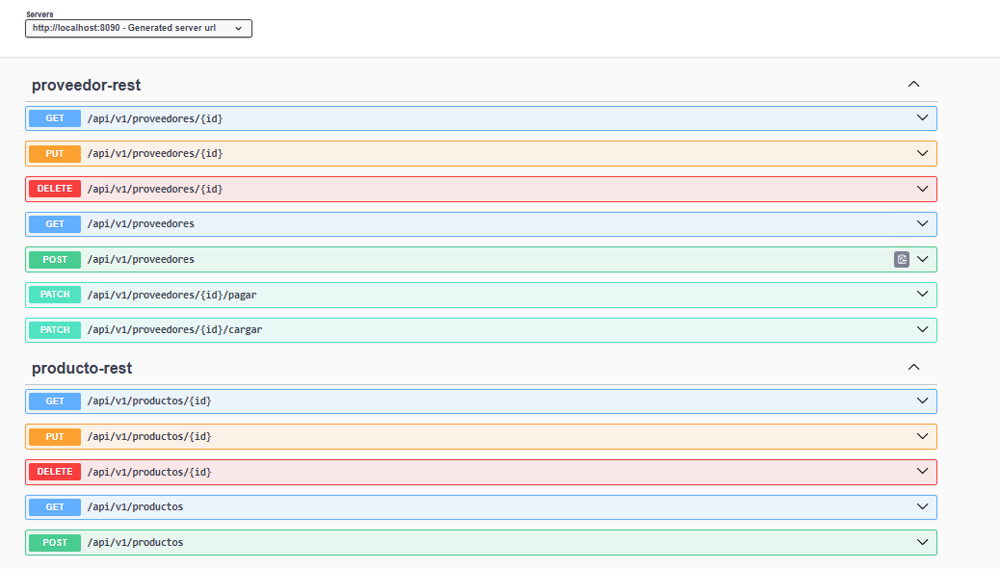
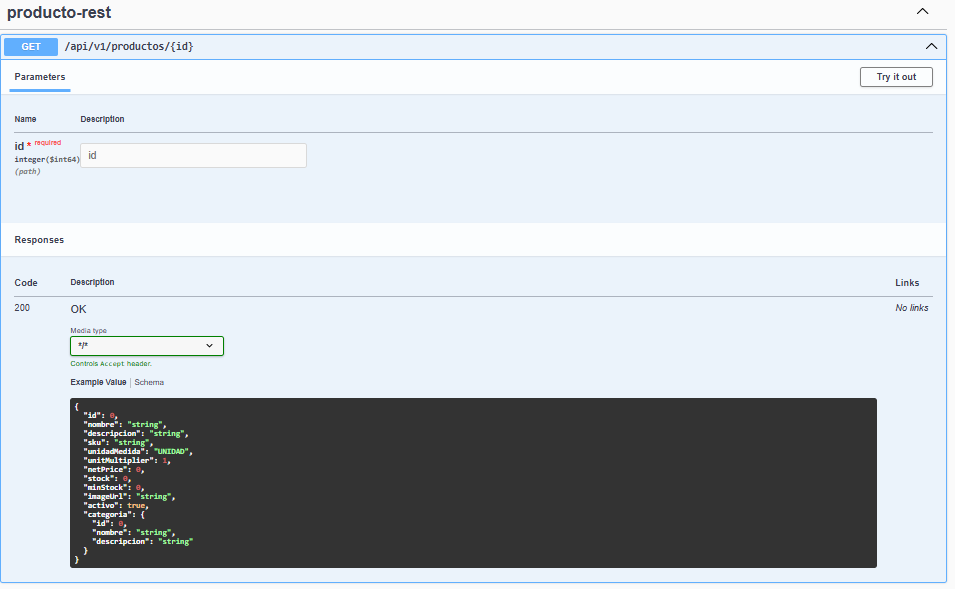
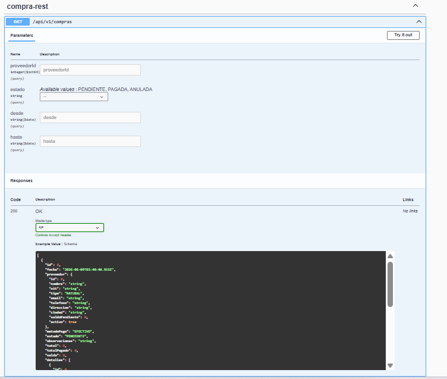
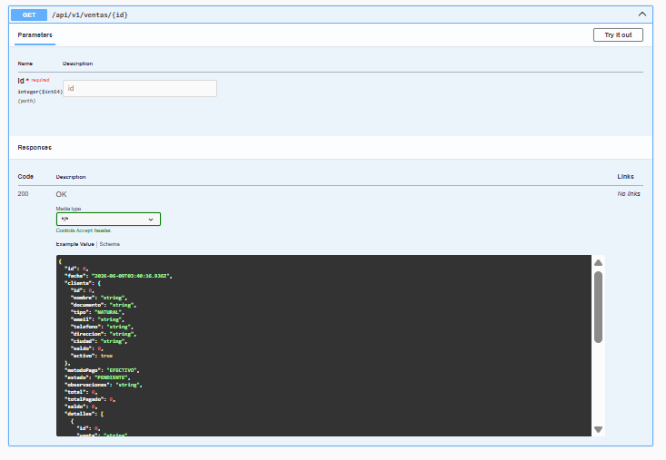
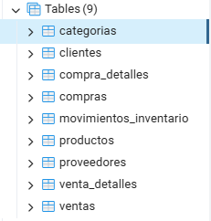

# 🥭 Frutimonchis Backend

Sistema Backend para la gestión de inventario, compras, ventas, clientes y proveedores desarrollado con Spring Boot y PostgreSQL.

---

## 🚀 Tecnologías utilizadas

- Java 21
- Spring Boot 3
- Spring Data JPA
- Hibernate
- PostgreSQL
- Maven
- Swagger / OpenAPI

---

## 📋 Funcionalidades

### Gestión de Productos

- Crear productos
- Consultar productos
- Actualizar productos
- Eliminar productos
- Gestión de categorías

### Gestión de Clientes

- Registro de clientes
- Consulta de clientes
- Actualización de clientes
- Eliminación de clientes

### Gestión de Proveedores

- Registro de proveedores
- Control de pagos
- Gestión de cuentas por pagar

### Gestión de Compras

- Registro de compras
- Detalle de compras
- Estados de compra

### Gestión de Ventas

- Registro de ventas
- Detalle de ventas
- Facturación

### Inventario

- Control de stock
- Movimientos de inventario
- Historial de movimientos

---

## 🏗 Arquitectura

El proyecto utiliza arquitectura multicapa:

```text
Controller
Service
Repository
Entity
DTO
```

---

## 🗄 Base de Datos

Tablas principales:

- categorias
- productos
- clientes
- proveedores
- compras
- compra_detalles
- ventas
- venta_detalles
- movimientos_inventario

---

## 📸 Capturas

### Swagger UI



### API Productos



### API Compras



### API Ventas



### PostgreSQL



---

## ▶️ Ejecución

### Clonar proyecto

```bash
git clone <url-del-repositorio>
```

### Ejecutar

```bash
mvn spring-boot:run
```

### Swagger

```text
http://localhost:8090/swagger-ui
```

---

## 👩‍💻 Autor

Maira Alejandra Rangel Murillo

Ingeniera de Sistemas